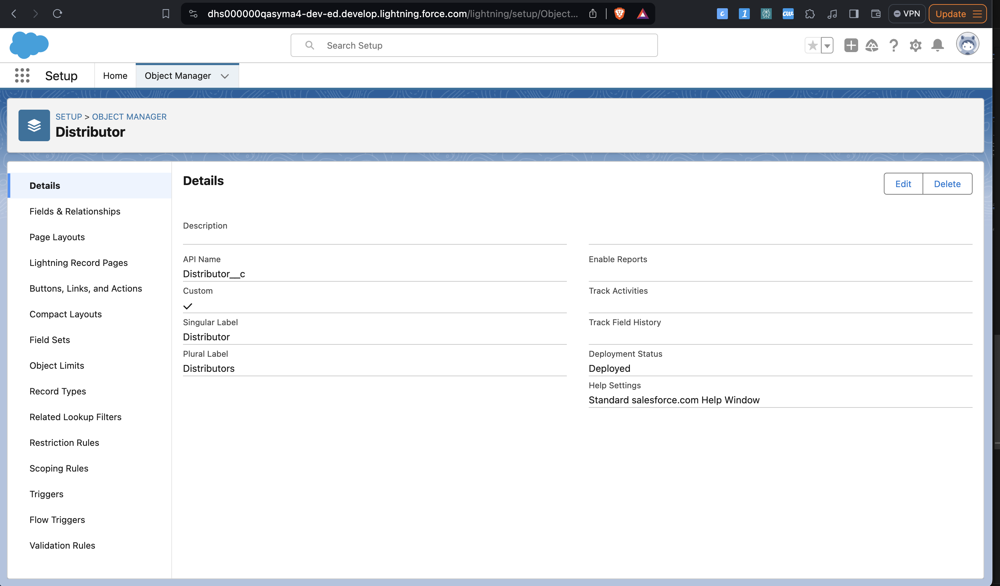
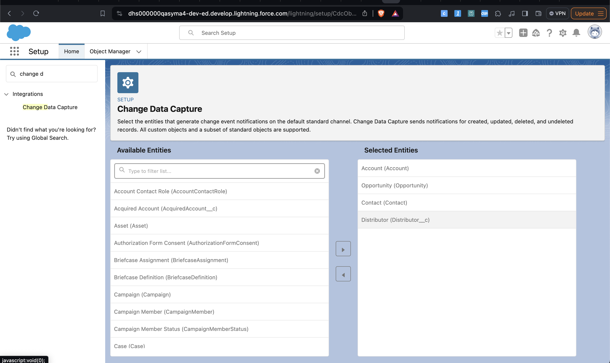
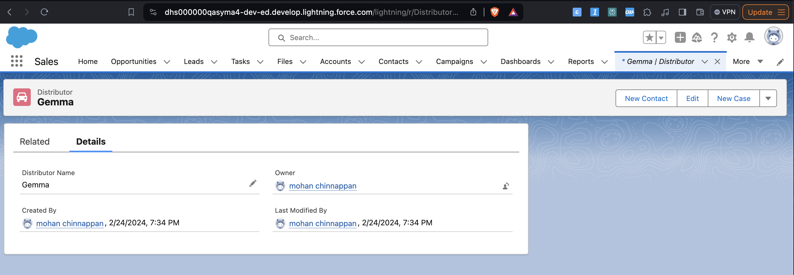
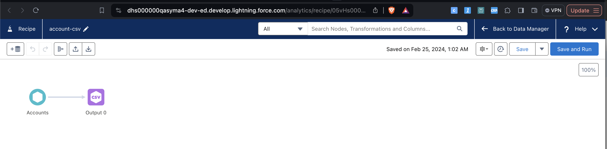
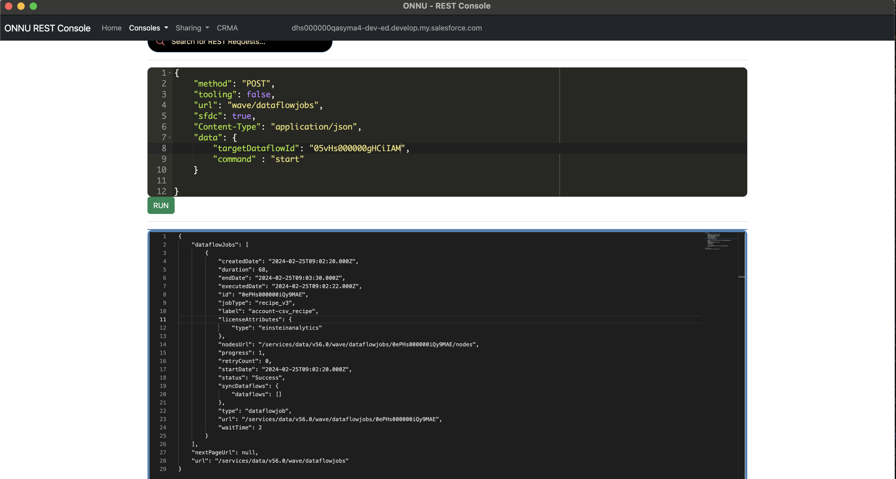
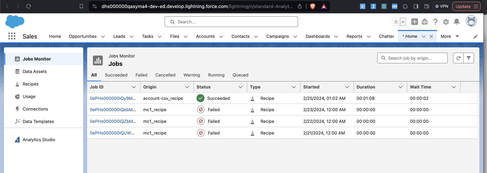
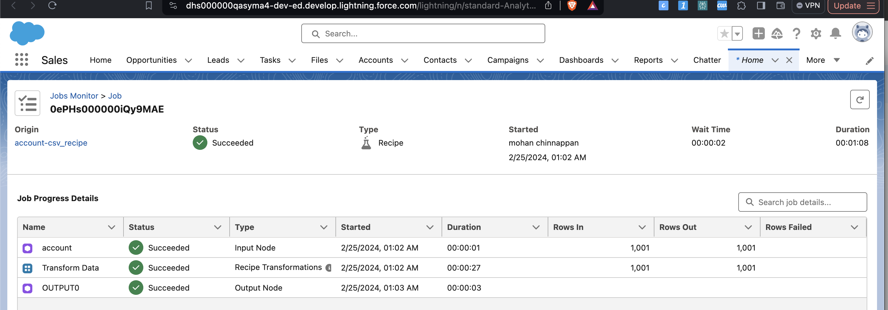

# Change Data Capture (CDC) and using CDC to trigger CRMA Recipes

## Topics
- [ CDC](#cdc)
    - [Using EMP - Enterprise Messaging Platform ](#emp)
    - [Using CLI](#cdc-cli)
- [CRMA Recipes](#crma-recipes)


<a name='cdc'></a>
- Streaming event 

- Notification that Salesforce sends when a change to a Salesforce record occurs as part of a create, update, delete, or undelete operation.

- The notification includes all new and changed fields, and header fields that contain information about the change. 
    - header fields indicate the **type of change** that triggered the event and the origin of the change
    - Change events support all custom objects and a subset of standard objects.


```json
{
     "data": {
         "schema": "IeRuaY6cbI_HsV8Rv1Mc5g", 
         "payload": {
             "ChangeEventHeader": {
                 "entityName": "Account", 
                 "recordIds": [
                    "<record_ID>"
                  ], 
                  "changeType": "CREATE", 
                  "changeOrigin": "com.salesforce.core", 
                  "transactionKey": "001b7375-0086-250e-e6ca-b99bc3a8b69f", 
                  "sequenceNumber": 1, 
                  "isTransactionEnd": true, 
                  "commitTimestamp": 1501010206653, 
                  "commitNumber": 92847272780, 
                  "commitUser": "<User_ID>"
             }, 
             "Name": "Acme", 
             "Description": "Worldwide leader in gadgets of the future.", 
             "OwnerId": "<Owner_ID>", 
             "CreatedDate": "2018-03-11T19:16:44Z", 
             "CreatedById": "<User_ID>", 
             "LastModifiedDate": "2018-03-11T19:16:44Z", 
             "LastModifiedById": "<User_ID>"
  }, 
  "event": {
      "replayId": 6
  }
 }, 
 "channel": "/data/ChangeEvents"
}
```

### When to use Change Data Capture


 - Receive notifications of Salesforce record changes, including create, update, delete, and undelete operations.
 - Capture field changes for all records.
 - Get broad access to all data regardless of sharing rules.
 - Get information about the change in the event header, such as the origin of the change, which allows ignoring changes that your client generates.
 - Perform data updates using transaction boundaries.
 - Use a versioned event schema.
 - Subscribe to mass changes in a scalable way.
 - Get access to retained events for up to three days.

### Example

#### Use Case
This client wants an integration that synchronizes Salesforce record data changes with their HR system, which is external to Salesforce. 

How to do it:

- Every new or changed Employee__c record is replicated in the HR data store.
- All Employee__c records are replicated along with their fields.
- The replication is transaction-based. If multiple updates are in a single transaction, the integration app sends these updates as part of one transaction as well.
- If the data replication process fails, it’s possible to resume the replication from past event notifications that are stored for up to three days.

- By subscribing to the channel for the Employee__c custom object, the app receives notifications for every change with all modified fields. 

The app can inspect the transactionKey and isTransactionEnd header fields in the notification to figure out if the change can be committed right away, or if the change should be combined with other changes and committed when isTransactionEnd = true. Because change events are stored for up to three days, the app can retrieve missed notifications.


----


- Select the entities that generate **change event notifications** on the **default standard channel**.
-  Change Data Capture sends notifications for 
    - created, 
    - updated, 
    - deleted,
    - undeleted records. 
- All custom objects and a subset of standard objects are supported.
<a name='EMP'></a>
## Using EMP (Enterprise Messaging Platform) Connector
- EMP Connector is a thin wrapper around the CometD library. It hides the complexity of creating a CometD client and subscribing to Streaming API in Java
- The CometD-based subscription mechanism in EMP Connector can receive any type of Salesforce event.


### Create a custom object Distributor

## Include Distributor__c into CDC



- To get a local copy of the EMP-Connector GitHub repository:
```
 git clone  https://github.com/forcedotcom/EMP-Connector.git

 brew install java
 brew install maven

```
- To build the EMP-Connector tool:
``` 
cd EMP-Connector 
 mvn clean package
```

- The mvn command generates JAR files in the target folder in the EMP-Connector project directory. The generated JAR file,  target/emp-connector-0.0.1-SNAPSHOT-phat.jar, includes the connector and the LoginExample functionality. The JAR contains all the dependencies for the connector, so you don’t have to download them separately.
- To run EMP Connector against your Developer Edition or Trailhead Playground org, type this command and supply your Trailhead Playground org or Salesforce org login credentials and the channel to subscribe to. In this example, the channel is /data/Employee__ChangeEvent.
```
 java -jar target/emp-connector-0.0.1-SNAPSHOT-phat.jar <username> <password> /data/Distributor__ChangeEvent

 ```

- Sample output

```
EMP-Connector git:(master) java -jar target/emp-connector-0.0.1-SNAPSHOT-phat.jar mohan.chinnappan.n.ea10@gmail.com 'pw and security_token' /data/Distributor__ChangeEvent 

Received:

```
```json
{"schema":"R5zq92JfedyvzEcBx9bE6g","payload":{"LastModifiedDate":"2024-02-25T02:27:17.000Z","OwnerId":"005Hs00000BkK19IAF","CreatedById":"005Hs00000BkK19IAF","ChangeEventHeader":{"commitNumber":11640258965714,"commitUser":"005Hs00000BkK19IAF","sequenceNumber":1,"entityName":"Distributor__c","changeType":"CREATE","changedFields":[],"changeOrigin":"com/salesforce/api/soap/60.0;client=SfdcInternalAPI/","transactionKey":"0001284f-bf79-b4c7-c7d8-de9e3018d47b","commitTimestamp":1708828037000,"recordIds":["a02Hs0000179WYrIAM"]},"CreatedDate":"2024-02-25T02:27:17.000Z","LastModifiedById":"005Hs00000BkK19IAF","Name":"Mohanc"},"event":{"replayId":15529385}}


```

```json
{
    "schema": "R5zq92JfedyvzEcBx9bE6g",
    "payload": {
        "LastModifiedDate": "2024-02-25T02:27:17.000Z",
        "OwnerId": "005Hs00000BkK19IAF",
        "CreatedById": "005Hs00000BkK19IAF",
        "ChangeEventHeader": {
            "commitNumber": 11640258965714,
            "commitUser": "005Hs00000BkK19IAF",
            "sequenceNumber": 1,
            "entityName": "Distributor__c",
            "changeType": "CREATE",
            "changedFields": [],
            "changeOrigin": "com/salesforce/api/soap/60.0;client=SfdcInternalAPI/",
            "transactionKey": "0001284f-bf79-b4c7-c7d8-de9e3018d47b",
            "commitTimestamp": 1708828037000,
            "recordIds": [
                "a02Hs0000179WYrIAM"
            ]
        },
        "CreatedDate": "2024-02-25T02:27:17.000Z",
        "LastModifiedById": "005Hs00000BkK19IAF",
        "Name": "Mohanc"
    },
    "event": {
        "replayId": 15529385
    }
}
```
- Update Example
```json
{
    "schema": "R5zq92JfedyvzEcBx9bE6g",
    "payload": {
        "LastModifiedDate": "2024-02-25T02:44:11.000Z",
        "ChangeEventHeader": {
            "commitNumber": 11640266867858,
            "commitUser": "005Hs00000BkK19IAF",
            "sequenceNumber": 1,
            "entityName": "Distributor__c",
            "changeType": "UPDATE",
            "changedFields": [
                "Name",
                "LastModifiedDate"
            ],
            "changeOrigin": "com/salesforce/api/soap/60.0;client=SfdcInternalAPI/",
            "transactionKey": "0001293b-f210-2b61-f231-5e86808edfd0",
            "commitTimestamp": 1708829051000,
            "recordIds": [
                "a02Hs0000179WYwIAM"
            ]
        },
        "Name": "sundar2"
    },
    "event": {
        "replayId": 15529395
    }
}
```

<a name='cdc-cli'></a>
### Using CLI

```


sf mohanc streaming sub -u  mohan.chinnappan.n.ea10@gmail.com  -t  /data/Distributor__ChangeEvent
```

```json
{
    "schema": "R5zq92JfedyvzEcBx9bE6g",
    "payload": {
        "LastModifiedDate": "2024-02-25T03:34:02.000Z",
        "OwnerId": "005Hs00000BkK19IAF",
        "CreatedById": "005Hs00000BkK19IAF",
        "ChangeEventHeader": {
            "commitNumber": 11640290483534,
            "commitUser": "005Hs00000BkK19IAF",
            "sequenceNumber": 1,
            "entityName": "Distributor__c",
            "changeType": "CREATE",
            "changedFields": [],
            "changeOrigin": "com/salesforce/api/soap/60.0;client=SfdcInternalAPI/",
            "transactionKey": "00012bf4-4444-5441-1180-b20f7074c9d5",
            "commitTimestamp": 1708832042000,
            "recordIds": [
                "a02Hs0000179WYsIAM"
            ]
        },
        "CreatedDate": "2024-02-25T03:34:02.000Z",
        "LastModifiedById": "005Hs00000BkK19IAF",
        "Name": "Gemma"
    },
    "event": {
        "replayId": 15529408
    }
}

```




### More from CLI
```
sf mohanc streaming sub -u  mohan.chinnappan.n.ea10@gmail.com  -t  /data/Distributor__ChangeEvent

```
- CREATE
```json
{
    "schema": "R5zq92JfedyvzEcBx9bE6g",
    "payload": {
        "LastModifiedDate": "2024-02-25T08:45:56.000Z",
        "OwnerId": "005Hs00000BkK19IAF",
        "CreatedById": "005Hs00000BkK19IAF",
        "ChangeEventHeader": {
            "commitNumber": 11640466190287,
            "commitUser": "005Hs00000BkK19IAF",
            "sequenceNumber": 1,
            "entityName": "Distributor__c",
            "changeType": "CREATE",
            "changedFields": [],
            "changeOrigin": "com/salesforce/api/soap/60.0;client=SfdcInternalAPI/",
            "transactionKey": "00013ce5-bacf-4027-b4cf-c067857a54dd",
            "commitTimestamp": 1708850756000,
            "recordIds": [
                "a02Hs0000179WZ2IAM"
            ]
        },
        "CreatedDate": "2024-02-25T08:45:56.000Z",
        "LastModifiedById": "005Hs00000BkK19IAF",
        "Name": "Mistral7b"
    },
    "event": {
        "replayId": 15529463
    }
}
```

- UPDATE

```json
{
    "schema": "R5zq92JfedyvzEcBx9bE6g",
    "payload": {
        "LastModifiedDate": "2024-02-25T08:46:44.000Z",
        "ChangeEventHeader": {
            "commitNumber": 11640466607976,
            "commitUser": "005Hs00000BkK19IAF",
            "sequenceNumber": 1,
            "entityName": "Distributor__c",
            "changeType": "UPDATE",
            "changedFields": [
                "Name",
                "LastModifiedDate"
            ],
            "changeOrigin": "com/salesforce/api/soap/60.0;client=SfdcInternalAPI/",
            "transactionKey": "00013cf0-cb61-dec0-e2bc-088707cf5744",
            "commitTimestamp": 1708850804000,
            "recordIds": [
                "a02Hs0000179WZ2IAM"
            ]
        },
        "Name": "Mistral-7b"
    },
    "event": {
        "replayId": 15529464
    }
}


```

<a name='crma-recipes'></a>

## CRMA Recipes

### Listing the recipes
```
  sf mohanc ea recipe list -u mohan.chinnappan.n.ea10@gmail.com  
```

---

```csv
"05vHs000000gHCiIAM","account_csv","R3"
"05vHs000000gH2pIAE","mc1","R3
```

### Start a Dataflow Job or Recipe
- To start a dataflow or recipe, use the /wave/dataflowjobs endpoint with a POST request. In the POST request body, use the dataflowId parameter to specify the dataflow to start. For a recipe, use the targetDataflowId value for the dataflowId



- Running by POSTing


```json
{
    "method": "POST",
    "tooling": false,
    "url": "wave/dataflowjobs",
    "sfdc": true,
    "Content-Type": "application/json",
    "data": {
        "targetDataflowId": "05vHs000000gHCiIAM",
        "command" : "start"
    }
    
}
```

```json

{
    "dataflowJobs": [
        {
            "createdDate": "2024-02-25T09:02:20.000Z",
            "duration": 68,
            "endDate": "2024-02-25T09:03:30.000Z",
            "executedDate": "2024-02-25T09:02:22.000Z",
            "id": "0ePHs000000iQy9MAE",
            "jobType": "recipe_v3",
            "label": "account-csv_recipe",
            "licenseAttributes": {
                "type": "einsteinanalytics"
            },
            "nodesUrl": "/services/data/v56.0/wave/dataflowjobs/0ePHs000000iQy9MAE/nodes",
            "progress": 1,
            "retryCount": 0,
            "startDate": "2024-02-25T09:02:20.000Z",
            "status": "Success",
            "syncDataflows": {
                "dataflows": []
            },
            "type": "dataflowjob",
            "url": "/services/data/v56.0/wave/dataflowjobs/0ePHs000000iQy9MAE",
            "waitTime": 2
        }
    ],
    "nextPageUrl": null,
    "url": "/services/data/v56.0/wave/dataflowjobs"
}


```
- Run Status

- Run Details



```
 sf mohanc ea dataflow jobs list -u mohan.chinnappan.n.ea10@gmail.com  
```

```csv
Id,Label,jobType,type,status,progress,startDate,executedDate, duration(secs)
"0ePHs000000iQy9MAE","account-csv_recipe","recipe_v3","dataflowjob","Success","1","2024-02-25T09:02:20.000Z","2024-02-25T09:02:22.000Z","68"
"0ePHs000000iQebMAE","mc1_recipe","recipe_v3","dataflowjob","Failure","0","2024-02-23T08:00:02.000Z","undefined","undefined"
"0ePHs000000iQZbMAM","mc1_recipe","recipe_v3","dataflowjob","Failure","0","2024-02-22T08:00:02.000Z","undefined","undefined"
"0ePHs000000iQUWMA2","mc1_recipe","recipe_v3","dataflowjob","Failure","0","2024-02-21T08:00:02.000Z","undefined","undefined"
```


## References

### Core
- [What is Change Data Capture?](https://developer.salesforce.com/blogs/2018/08/what-is-change-data-capture)
- [CDC Guide](https://developer.salesforce.com/docs/atlas.en-us.change_data_capture.meta/change_data_capture/cdc_intro.htm)
- [CDC Developer Guide](https://developer.salesforce.com/docs/atlas.en-us.248.0.change_data_capture.meta/change_data_capture/cdc_intro.htm)
- [Subscribe to an Event Channel](https://trailhead.salesforce.com/content/learn/modules/change-data-capture/subscribe-to-events)
- [Streaming API Developer Guide](https://developer.salesforce.com/docs/atlas.en-us.api_streaming.meta/api_streaming/code_sample_java_client_intro.htm)

### CRMA
- [CRM Analytics REST API Developer Guide](https://developer.salesforce.com/docs/atlas.en-us.bi_dev_guide_rest.meta/bi_dev_guide_rest/bi_run_schedule_sync_data.htm?q=recipe)